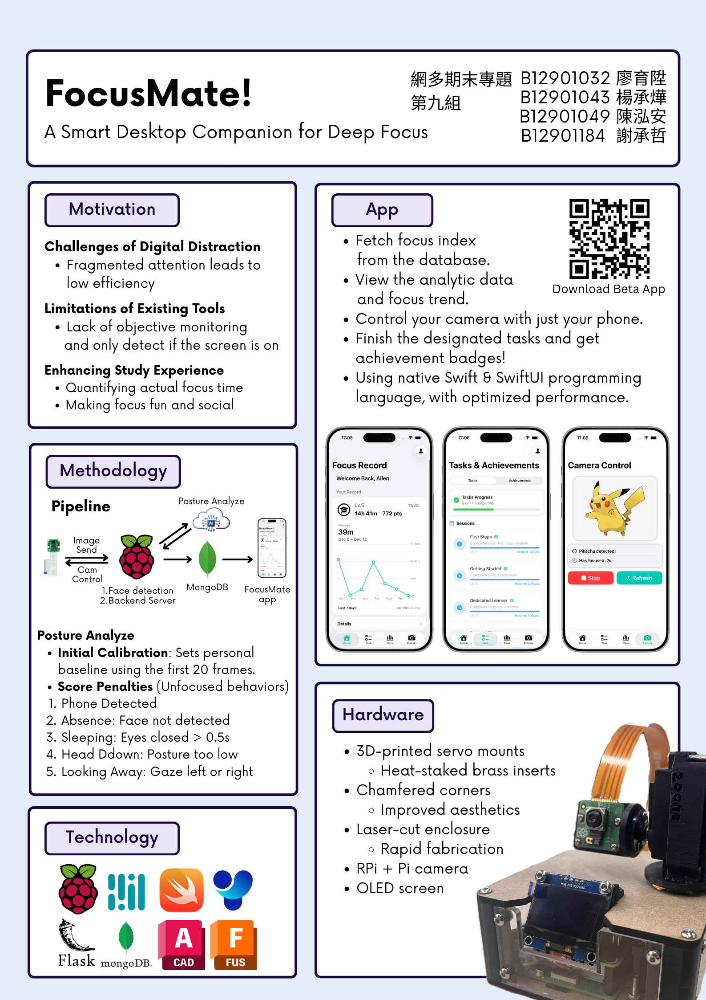

# FocusMate!
### Network and Multimedia Lab Final Project（網多期末專題）

第九組
B12901032 廖育陞
B12901043 楊承燁
B12901049 陳泓安
B12901184 謝承哲

## About this Project
This is the final project of Network and Multimedia Lab (114-1). We tackles digital distraction in study environments, where fragmented attention reduces efficiency. Unlike existing tools that rely only on screen activity, our system quantifies actual focus time and incorporates social and interactive elements to make staying focused more engaging and effective.




## Setup
### Hardware
You will have to rebuild our device from scratch.
see `CAD/` for the 3D-printed parts.
BOM and instructions is not provided at this stage.

### Backend

```bash
source venv/bin/activate
python3 backend/server.py
```
In `face_tracking/tracker.py`
```python
def tracker_task(stop_event, picamera2):
    ws.connect("ws://YOUR_BACKEND_SERVER:8765")
```
To launch the main app
```bash
python3 app.py
```


### App
1. If you have installed Xcode:
    a. Open NMLab_Final_App.xcodeproj
    b. Change the Signing Team / Bundle Identifier in project settings if necessary.
    c. Build the project on device / simulator via Xcode.
2. If you have NOT installed Xcode:
    a. Install "TestFlight" on your device (iOS / iPadOS 18.0+), link: https://apps.apple.com/tw/app/testflight/id899247664
    b. Open the link: https://testflight.apple.com/join/HArqB6Px to join the public testing group.
    c. Install the app on TestFlight.
